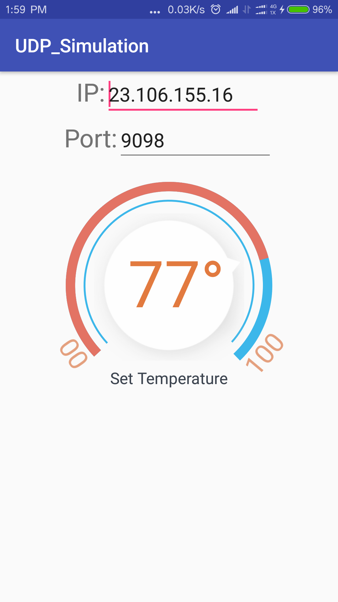
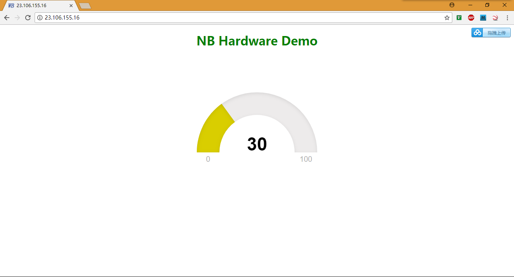

# NB Hardware Demo

这个Demo花了两天时间，用于验证NB IOT模块通信，做完之后序礼给我一个教程，现在没时间看，先留在这里：
  * [NB-iot开发板相关资料及NB-iot接入教程](https://open.iot.10086.cn/bbs/thread-2375-1-1.html)

包含：
  * STM32 Demo；
  * Android UDP Demo；
  * PHP网站，里面目前未使用到PHP，使用了WebSocket实时通信；
  * WebSocket Demo；

本Demo涉及到的代码未进行优化，有点乱乱的感觉，以后有时间再来优化处理，不过也有可能永远不会来处理。

## MCU

* [STM32 Demo](stm32/StdPeriph)
* [Test With Serial Port Command](stm32/Test_With_Serial_Port_Command.md)
* [Send Simulation Temperature To Server](stm32/Send_Simulation_Temperature_To_Server.md)

## Android

* [android/UDP_Simulation](android/UDP_Simulation)
* [UDP_Simulation Apk Download](android/UDP_Simulation_20170925.apk)
  

## website

* [PHP Website](http://zorozeng.com/NB_HW_Demo/website/)
  

## websocket

* WebSocket For PHP Website
  * [A simple UDP echo server](https://www.cs.cmu.edu/afs/cs/academic/class/15213-f99/www/class26/udpserver.c)
  * [A simple UDP client](https://www.cs.cmu.edu/afs/cs/academic/class/15213-f99/www/class26/udpclient.c)
  * [UDP packetsender tool](https://packetsender.com/download)
