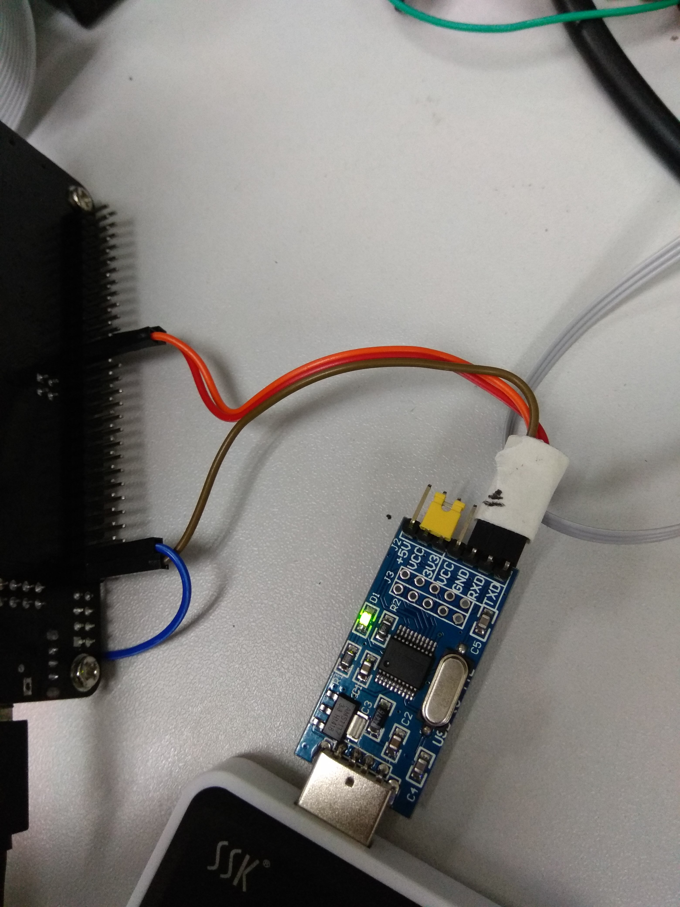
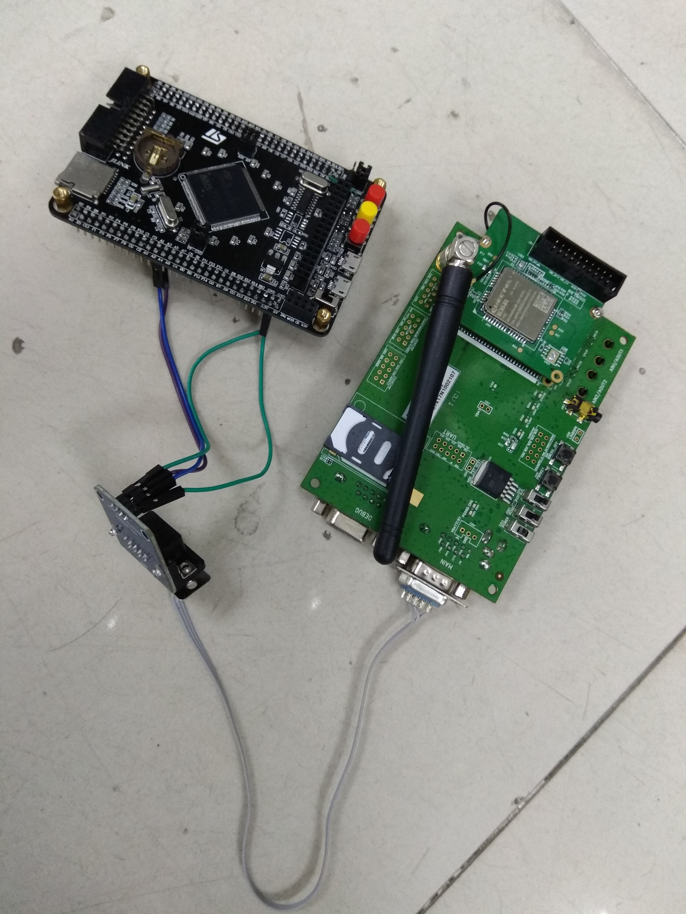

# STM32 Debug Infomation

## 命令生成连接



## 实际连接

**请注意这里的UART TO RS232模块的只能接TX，不能接RX，貌似是这个模块有问题，电量不够。**



## 主要执行的命令

* `"AT+NSOCR=DGRAM,17,4587,1\r\n"`
* `"AT+NSOST=0,120.24.184.124,8010,8,176A9B108A233531\r\n"`

## UDP Server

```
STM32: {"temperature":52}
server received datagram from 72.52.109.183
server received 8/-1 bytes: u=€@辟52
```
