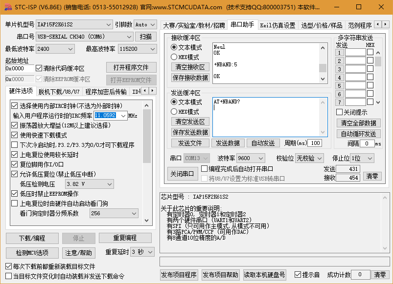

# STM32 Debug Infomation

## 串口工具下载

* [STC ISP Tool](http://www.stcmcudata.com/STCISP/stc-isp-15xx-v6.86E.zip)，使用STC提供的免费的串口工具，**不过要注意其发送缓冲区的`Enter键`就是`\r\n`**。
  

## UDP Commands

### Send Data Message

* 创建UDP Socket，参考《Quectel_BC95_AT_Commands_Manual_V1.7.pdf》：  
  `AT+NSOCR=DGRAM,17,4587,1`
* 使用Socket 0发送012356到23.106.155.16:9098服务器，要通过运营商服务器120.24.184.124:8010进行中转，包括目标服务器地址、端口号，总共发送12个字节数据，参考《UDP数据转发网关收发数据格式.pdf》：  
  `AT+NSOST=0,120.24.184.124,8010,12,176A9B108A23303132333435`
* **注意**：以上命令末尾都要有`\r\n`结尾。

### Server Get Date Message

* 效果图：
  
* Data
  ```
  server received datagram from 72.228.117.183
  server received 12/-1 bytes: u=伾C.012345
  ```
* 获取的数据前面不可见字符是终端设备的端口号和IP地址；
